# Google-UX-design-project

Описание: 
Данный проект был реализован мной в рамках профессиональной сертификационной программы «Google UX design» от концепции до delivery в строгом соответствии с требованиями (алгоритмом) дизайна пользовательского опыта (UX design) компании Google. 
Для проведения видео интервью с реальными жителями штата Калифорния США было использовано мобильное приложение «Hello Talk» (свободно доступно на Google Play), благодаря функции доступа к геолокации пользователей позволившее мне войти в контакт с жителями интересующей меня локации. 
Я проводил интервью и создавал карты эмпатии, чтобы понять потребности пользователей, для которых я разрабатывал приложение. Одной из основных групп пользователей, выявленных в ходе исследования, были работающие взрослые, состоящие в браке, имеющие маленьких детей и совмещающие обязанности молодого родителя с предпринимательской деятельностью. Другая группа - взрослые, которые хотели сосредоточиться на своей личной жизни с партнерами и после изоляции из-за COVID-19 хотели проводить больше времени в общественных местах. 
Приложение чат-бота поддержки для семейного ресторана в Калифорнии (далее именуемое RestFam App) - это продукт будущей онлайн-системы, разработанной для повышения удовлетворенности посетителей семейных ресторанов, географически расположенных в пригородах или городах Калифорнии. Приложение позволяет найти подходящий семейный ресторан, забронировать столик, сделать заказ без привлечения персонала ресторана, используя чат-бот поддержки. Целевыми клиентами продукта являются семьи и люди, находящиеся в отношениях, которые недовольны существующими предложениями продуктов, не отвечающими многим ключевым потребностям клиентов. 
Я заметил, что наши конкуренты предлагают специальные мобильные приложения для своих клиентов, через которые можно сделать заказ, но они не учитывают многие моменты, из-за которых клиенты не получают удовлетворения и надлежащего результата от процесса, поэтому конкуренты не могут быть такими успешными, как могли бы. Я разработал продукт, который может повысить удовлетворенность клиентов и благодаря этому увеличить продажи по сравнению с конкурентами. 
Выполненные мной этапы разработки цифрового продукта: 

- Стенограммы интервью Interview Transcripts и карты эмпатии Empathy Maps; 
- Персоны Personas; 
- Пользовательские истории User Story; 
- Карта пути пользователя User Journey Map; 
- Формулирование проблемы Problem Statement; 
- Утверждение гипотезы Hypothesis Statement; 
- Ценностные предложения Value Propositions; 
- Конкурентный аудит Competitive Audit; 
- Отчет о конкурентном аудите Competitive Audit Report; 
- Заявление о цели Goal Statement; 
- Пользовательский поток User Flow; 
- Ручная раскадровка большой картины Storyboard Big Picture; 
- Ручная раскадровка крупным планом Storyboard Close Up; 
- Бумажные каркасы Paper Wireframe (Home screen, Menu, Map, Ingredients, Cart); 
- Цифровые каркасы Digital Wireframes; 
- Прототип низкой точности с ссылками Low Fidelity Prototype with link; 
- План исследования пользовательского опыта UX Research Study Plan; 
- Исследование удобства использования приложения Usability study note-taking spreadsheet; 
- Диаграмма родства Affinity Diagram; 
- Идентификация закономерностей и инсайтов Pattern and Insight Identifications; 
- Первая исследовательская презентация Research Presentation first; 
- Вторая исследовательская презентация Research Presentation second; 
- Прототип высокой точности с ссылками High Fidelity Prototype with link; 
- Финальная презентация слайдов тематического исследования Final Project Presentation. 

**Финальная презентация слайдов тематического исследования:** 
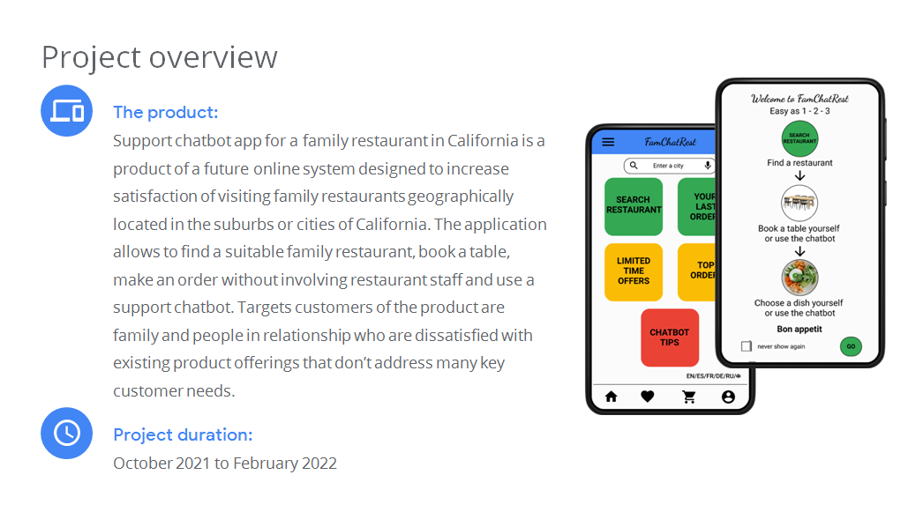 
**Финальная презентация слайдов тематического исследования:** 
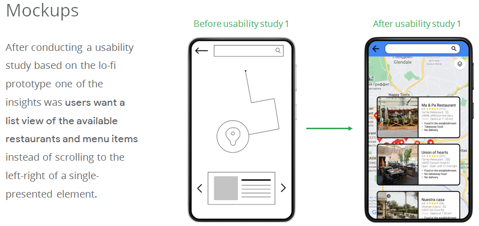 
**Финальная презентация слайдов тематического исследования:** 
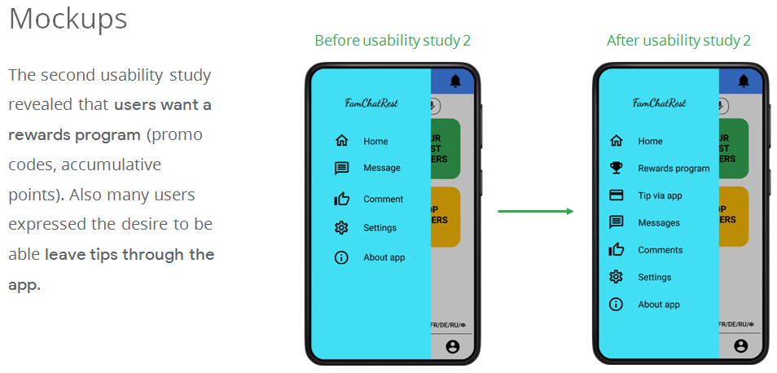 
**Финальная презентация слайдов тематического исследования:** 
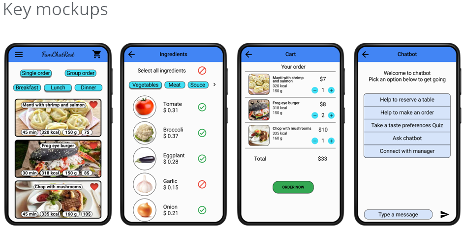 
**Прототип высокой точности с ссылками High Fidelity Prototype with link:** 
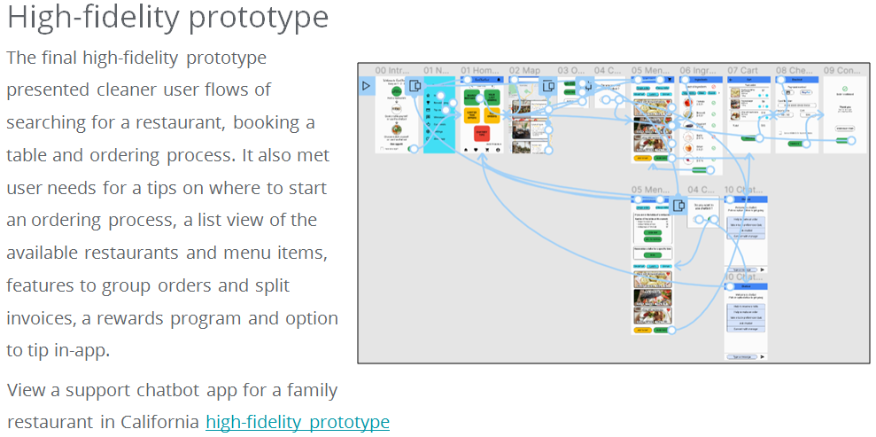 
**Скриншоты всех макетов и каркасов проекта из Figma:** 
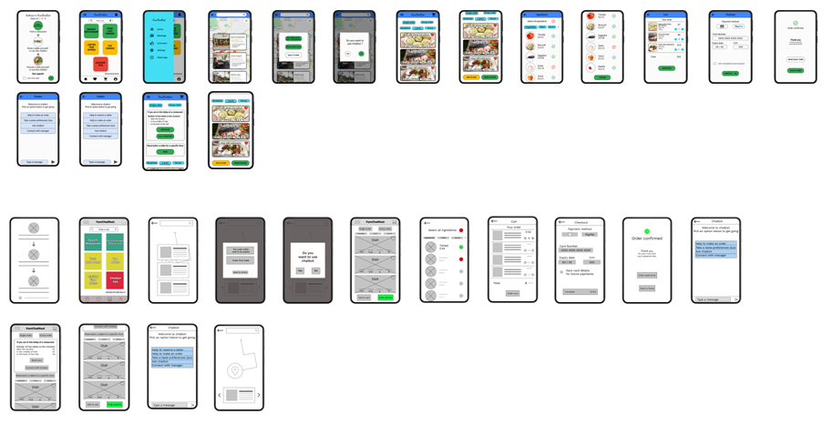 
**Карта эмпатии (групповая) Empathy Map:** 
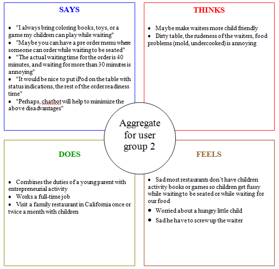 
**Персоны Personas:** 
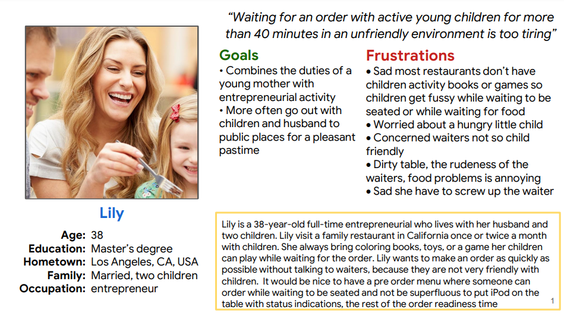 
**Карта пути пользователя User Journey Map:** 
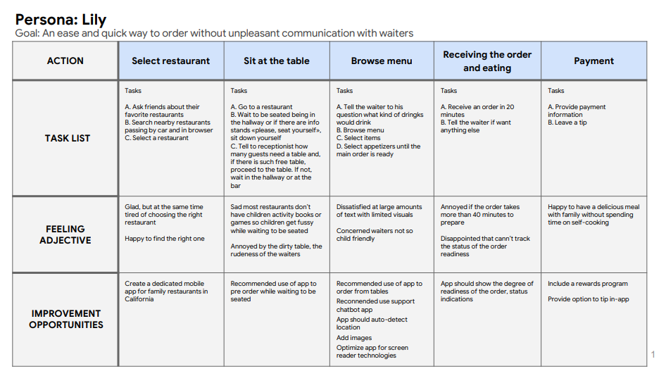 
**Конкурентный аудит Competitive Audit:** 
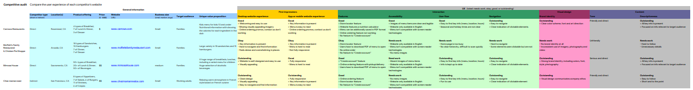 
**Пользовательский поток User Flow:** 
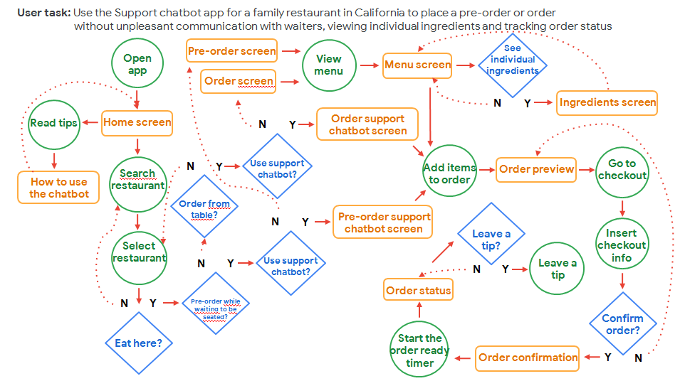 
**Ручная раскадровка крупным планом Storyboard Close Up:** 
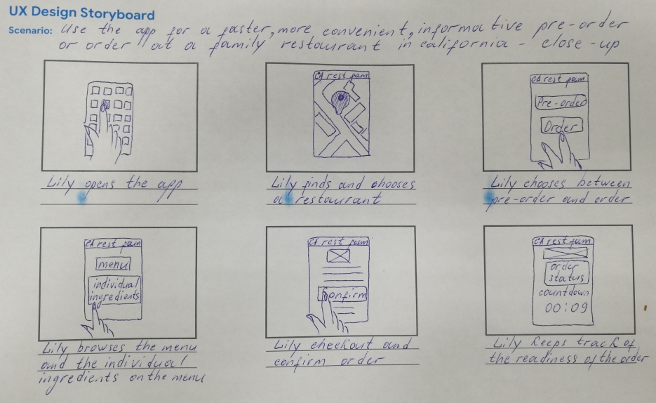 
**Бумажные каркасы Paper wireframes:** 
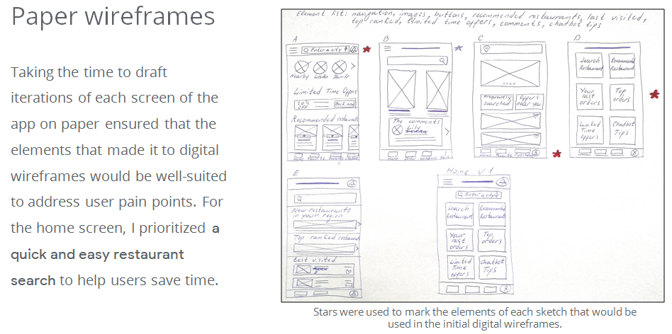 
**Прототип низкой точности с ссылками Low Fidelity Prototype with link:** 
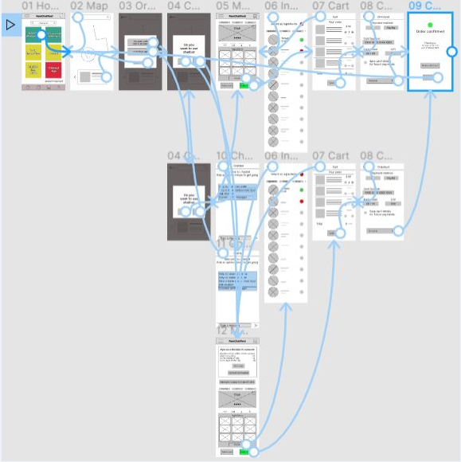 
**План исследования пользовательского опыта UX Research Study Plan:** 
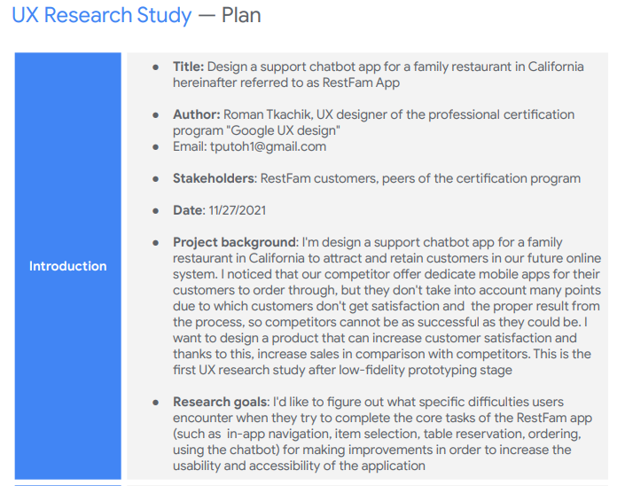 
**Исследование удобства использования приложения Usability study note-taking spreadsheet:** 
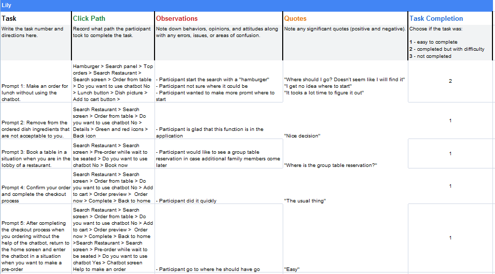 
**Первая исследовательская презентация Research Presentation first:** 
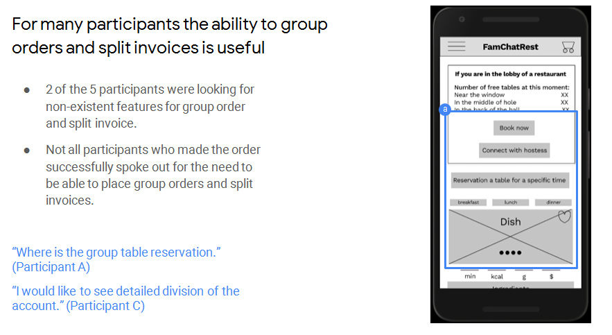 
**Вторая исследовательская презентация Research Presentation second:** 
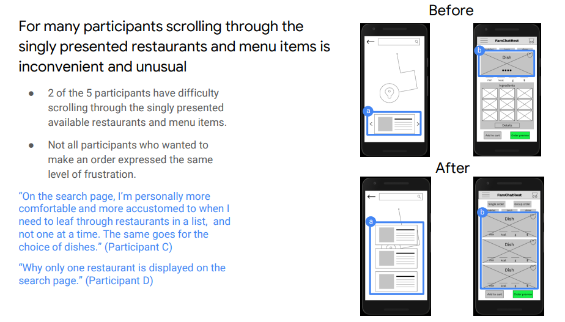 
